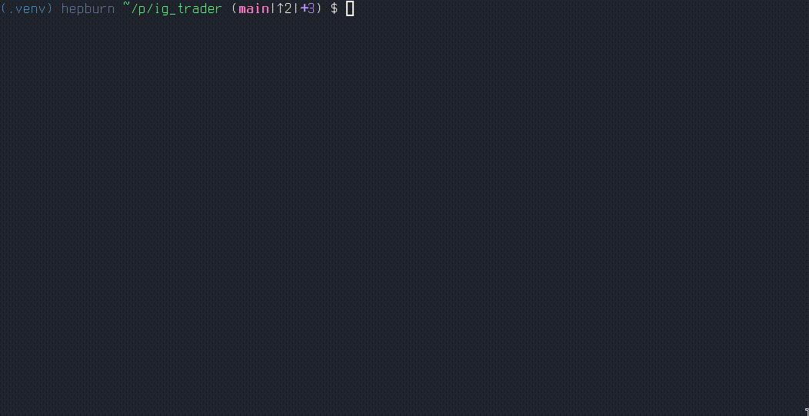

# tradedesk-dukascopy


Dukascopy tick downloader and candle exporter for use in backtesting your trading strategies.



This tool downloads raw tick data from Dukascopy, converts it into clean,
deterministic CSV candle files, and writes a metadata sidecar describing exactly
how the data was produced.

It is designed to be run once per dataset, not repeatedly during backtests.


---

## Quick start

Install:

```bash
pip install tradedesk-dukascopy
```

Export 5-minute candles for EURUSD:

```bash
tradedesk-dc-export --symbol EURUSD \
  --from 2025-01-01 --to 2025-01-31 \
  --out data \
  --price-divisor 1000
```

This produces:

```text
data/
  EURUSD_5MIN.csv
  EURUSD_5MIN.csv.meta.json
```

You can now point your backtest engine at the CSV file directly.

---

## Output files

### Candle CSV

The CSV file contains OHLCV candles with timestamps in UTC (ISO-8601):

```text
timestamp,open,high,low,close,volume
2025-01-01T00:00:00+00:00,1.10342,1.10361,1.10311,1.10355,1234.0
```

- Timestamps are always **UTC**
- Prices are floats **after applying the price divisor**
- Volume is derived from tick volume (bid / ask / mid, depending on settings)

### Metadata sidecar (`.meta.json`)

Every CSV is accompanied by a metadata file describing how it was generated:

```json
{
  "schema_version": "1",
  "source": "dukascopy",
  "symbol": "EURUSD",
  "data_type": "candles",
  "timestamp_format": "iso8601_utc",
  "price_divisor": 100000.0,
  "generated_at": "2026-01-03T12:34:56Z",
  "params": {
    "resample": "5min",
    "side": "bid",
    "date_from": "2025-01-01",
    "date_to": "2025-01-31"
  }
}
```

This ensures datasets are **self-describing and reproducible**, even months later.

---

## Price scaling (`--price-divisor`)

Dukascopy tick prices are stored as integers or scaled values depending on the
instrument.

This tool applies **price scaling once, at export time**, using `--price-divisor`.

Examples:

| Instrument | Typical divisor |
|----------|-----------------|
| EURUSD   | `1000` |
| USDJPY  | `100000` |
| Indices | `1` or `10` |

If unsure, use probe mode:

```bash
tradedesk-dc-export --symbol GBPSEK \
  --from 2025-07-01 --to 2025-07-01 \
  --probe
```

Probe mode prints sample ticks at different divisors without writing files.

---

## Intended workflow

This tool is intended to be used as a **data preparation step**, not as part of
your backtest runtime loop:

1. Download and export historical data once
2. Commit or archive the CSV + metadata
3. Run fast, deterministic backtests against local files

---

## Requirements

- Python 3.11+
- Internet access to Dukascopy datafeed

---

## License

Licensed under the Apache License, Version 2.0.
See: https://www.apache.org/licenses/LICENSE-2.0

Copyright 2026 [Radius Red Ltd.](https://github.com/radiusred)
